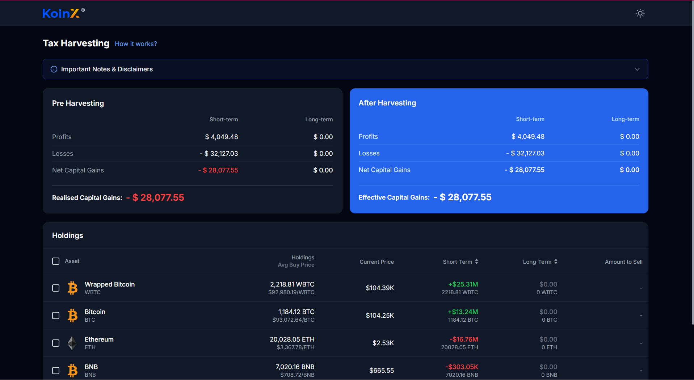

# KoinX Tax Loss Harvesting Dashboard

A modern, dynamic web application designed to help crypto users simulate and calculate their potential tax savings (tax loss harvesting) for the financial year 2024-25. 



## Features
- **Dynamic Tax Calculation**: Real-time updates to Net Capital Gains, Profits, and Losses as you select/deselect assets.
- **Smart Formatting**: Compact currency formatting (e.g., $1.2M, $45.2K) with full-value tooltips on hover.
- **Sorting Integration**: Sort your portfolio by Short-Term or Long-Term gains to easily identify the best assets to harvest.
- **Dark Mode Support**: Full light and dark mode integration matching premium modern design standards.
- **Responsive Layout**: Designed to work fluidly across desktop, tablet, and mobile displays.

## Tech Stack
- **Framework**: [Next.js 14 (App Router)](https://nextjs.org/)
- **Language**: TypeScript
- **Styling**: Tailwind CSS
- **Data**: Mock APIs simulating backend network latency

## How to Start the Project

### Prerequisites
Make sure you have [Node.js](https://nodejs.org/) installed on your machine.

### Installation

1. Clone the repository:
   ```bash
   git clone https://github.com/AnujYelve/KoinX.git
   ```
2. Navigate into the project folder:
   ```bash
   cd KoinX
   ```
3. Install the dependencies:
   ```bash
   npm install
   ```

### Running the Development Server

Start the local development server:
```bash
npm run dev
```
Open [http://localhost:3000](http://localhost:3000) in your browser to view and interact with the dashboard.
